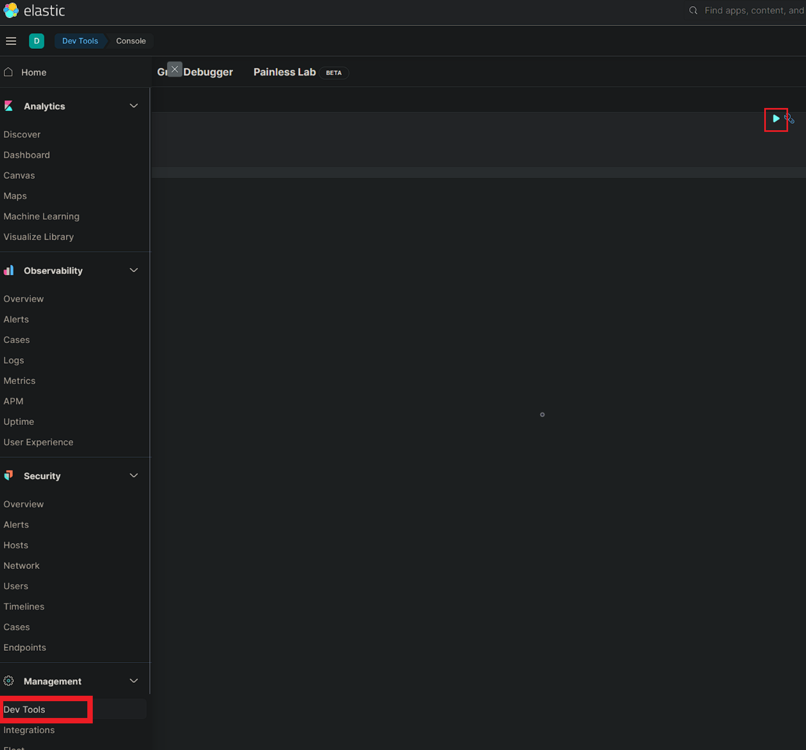
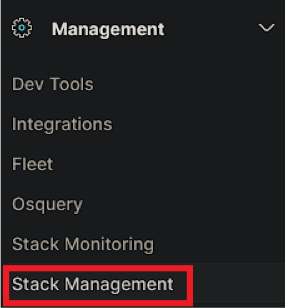
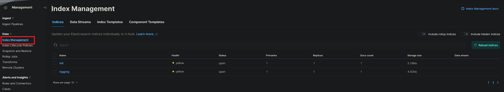

# Elastic logging

This example delves into logging a route from FastAPI. Elasticsearch (ES) is a NoSQL database and stores data in
documents.
It aims to monitor logs, that are created by a route of FastAPI.

## Architecture

A new Docker container is created and specified in the `Dockerfile-ES` file. This example adds two new containers:

- Elasticsearch
- Kibana

While Elasticsearch stores all data, Kibana is used as a frontend tool to show stored data of an ES database.

## Use case

There is a new route: `/es-log`. The ES is set up to log the following parameters in a document every time this route is
called:

- route name
- custom message
- timestamp

## Setup

The containers are created automatically when building all Docker containers. Run the following command in the projects
root directory in a terminal to build them:

~~~~
docker-compose up -d --build
~~~~

This builds all Docker containers specified in the `docker-compose.yml` file, which is located in the root directory of
this project.  
The associated Dockerfile is `Dockerfile-ES`.

There may occur an error regarding `vm.max_map_count` value, which is to low out of the box. There is an official guide
on the elastic website,
which shows how to set `vm.max_map_count` to at least `262144`:
[Elastic Link](https://www.elastic.co/guide/en/elasticsearch/reference/current/docker.html#docker-prod-prerequisites)  
Copy and paste the commands depending on your OS and used software.

### Kibana

As described above, Kibana is a tool to show data in an ES database. Open `http://localhost:5601/` to call Kibana
dashboard.

#### Show stored documents

Open Dev Tools and hit the run button to show all stored documents.

#### Available routes

Call the `Index management` site to see all available routes. This is handy to make sure that Kibana can access
Elasticsearch.

