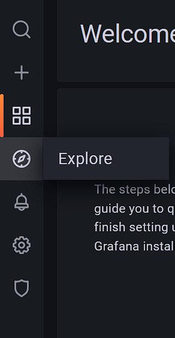
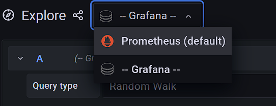
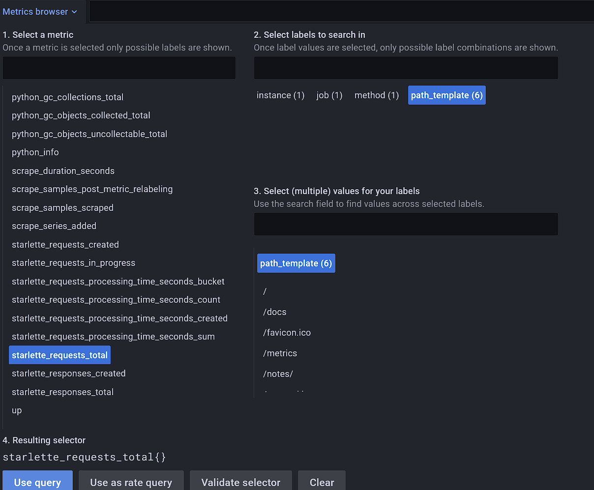

# Monitoring

This example adds a metrics service for the CRUD API, which is useful to monitor your API. There are multiple reasons
you want to use this, for example checking availability, performance and correct responses.

## Architecture

This example adds two new containers, specified in the `docker-compose.yml` file:

- Grafana
- Prometheus

Prometheus stores data and Grafana is a GUI to show them formatted.

## Use case

The goal is to detect issues and conspicuous behavior of your API.
For example, you can monitor how often a specific route is called. Or the processing time can be monitored.

## Setup

The containers are created automatically when building all Docker containers. Run the following command in the projects
root directory in a terminal to build them:

~~~~
docker-compose up -d --build
~~~~

This builds all Docker containers specified in the `docker-compose.yml` file, which is located in the root directory of
this project.\
There is no specific Dockerfile for this example, everything is described in the Compose-file.

### Log-In

Visit Grafana's UI in your browser: `http://localhost:3000`.\
The username is: `admin` and password: `GrafanaPW` by default. This can be changed in the file `config.monitoring` file.

- Open the explore tab

- Choose Prometheus as the datasource

- Choose a metric by clicking on an entry
  Then click `Use query`. A new Graph is created below with all your selected parameters.

