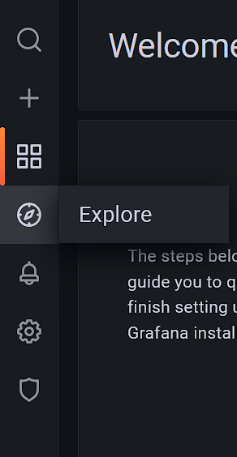
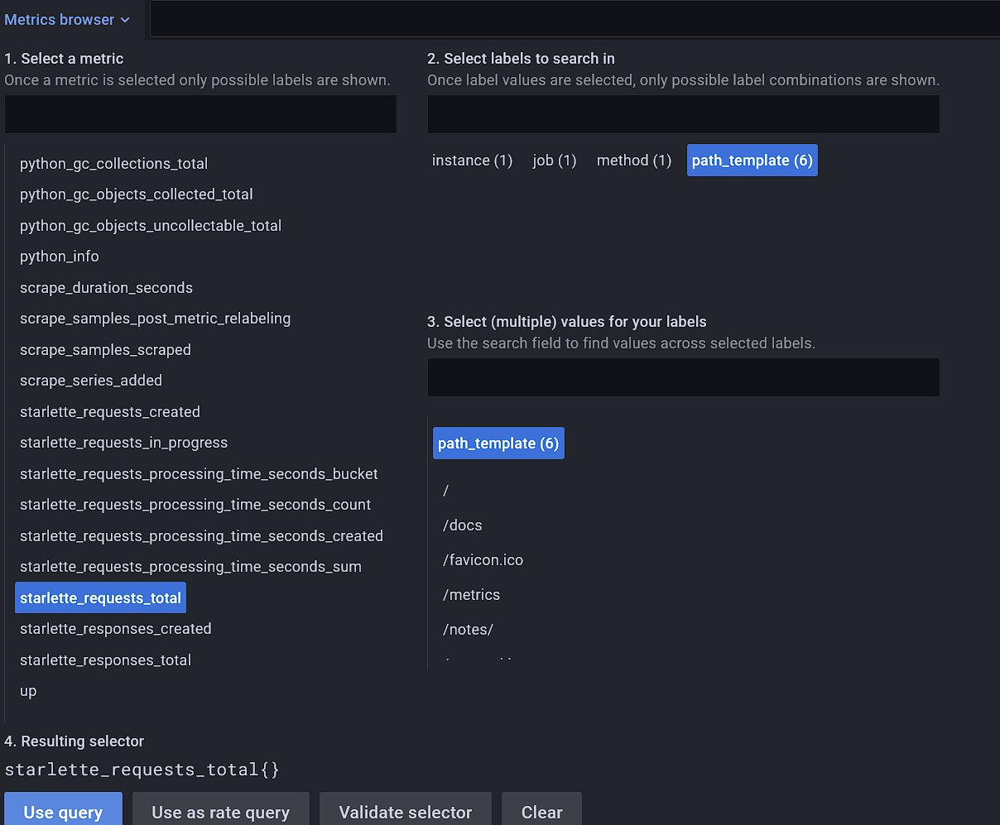

# Log-In
Visit Grafana's UI in your browser: `http://localhost:3000`.\
The username is: `admin` and password: `GrafanaPW` by default. This can be changed in the file `config.monitoring`.

## Explore
Open the explore tab

## Datasource
Choose Prometheus as the datasource

## Metrics
Choose a metric by clicking on an entry.
Then click `Use query`. A new Graph is created below with all your selected parameters.

