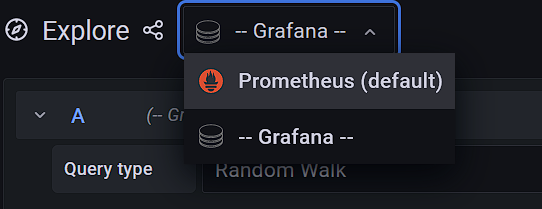

# pythonic-api-design

## Docker:
First, please install Docker Desktop from this [LINK](https://docs.docker.com/desktop/#download-and-install).
### Build Docker containers:
`docker-compose up -d --build`

## Grafana

### Log-In
Visit Grafana's UI in your browser: `http://localhost:3000`.
The username is: `admin` and password: `GrafanaPW` by default. This can be changed in the file `config.monitoring`.

#### Open the explore tab

#### Choose Prometheus as the datasource

#### Choose your metric
Then click `Use query`. A new Graph is created below with all your selected parameters.
